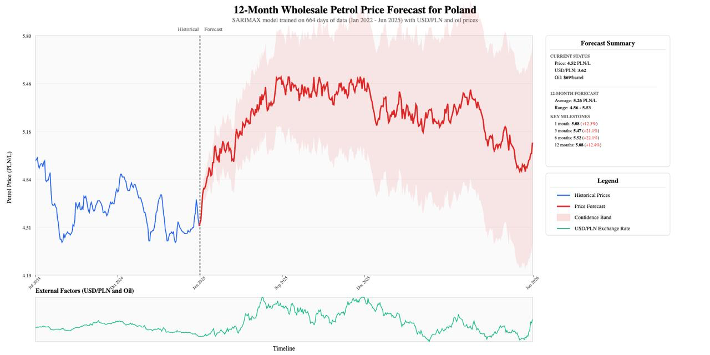

# PetroPredict - Polish Petrol Price Forecasting System

## Overview

PetroPredict is an advanced analytics solution built on Microsoft Fabric that forecasts wholesale petrol prices in Poland. The system combines multiple data sources including oil prices, exchange rates, and historical petrol prices to generate accurate 12-month forecasts using SARIMAX (Seasonal AutoRegressive Integrated Moving Average with eXogenous variables) modeling.



## Key Features

- **Multi-Source Data Integration**: Automatically collects data from multiple APIs and web sources
- **Advanced Time Series Forecasting**: SARIMAX model with external factors for improved accuracy
- **Real-time Data Pipeline**: Automated data refresh and model retraining
- **Interactive Visualizations**: Power BI reports with historical trends and forecasts
- **Confidence Intervals**: 95% confidence bands for risk assessment

## Architecture

The solution is built on Microsoft Fabric and consists of:

1. **Data Ingestion Notebooks**
   - `LoadFXRates`: Fetches USD/PLN and EUR/PLN exchange rates from National Bank of Poland (NBP)
   - `LoadOilPrice`: Retrieves Brent and WTI oil prices from Energy Information Administration (EIA)
   - `LoadPolishPetrolPrices`: Scrapes historical petrol prices from Polish fuel retailers

2. **Forecasting Engine**
   - `SARIMAX_Forecast_Lakehouse`: Implements the forecasting model with feature engineering

3. **Data Storage**
   - Microsoft Fabric Lakehouse with Delta tables for efficient querying

4. **Visualization Layer**
   - Power BI semantic model and reports for business insights

## Data Sources

| Source | Data Type | Update Frequency | History |
|--------|-----------|------------------|---------|
| NBP API | Exchange Rates (USD/PLN, EUR/PLN) | Daily | 1000 days |
| EIA API | Oil Prices (Brent, WTI) | Daily | Variable |
| Lotos Archives | Polish Petrol Prices | When available | Full history |

## Installation & Setup

### Prerequisites

- Microsoft Fabric workspace
- Python environment with required packages
- API keys for:
  - EIA (Energy Information Administration)
  - Access to NBP API (no key required)

### Configuration

1. **Environment Variables**
   Create a `.env` file with:
   ```env
   EIA_API_KEY=your_eia_api_key_here
   FABRIC_WORKSPACE_ID=your_workspace_id_here
   FABRIC_LAKEHOUSE_ID=your_lakehouse_id_here
   ```

2. **Install Dependencies**
   ```bash
   pip install pandas numpy matplotlib seaborn requests beautifulsoup4 lxml pyspark
   ```

3. **Configure Fabric Connection**
   - Import notebooks to your Fabric workspace
   - Update lakehouse connections in each notebook
   - Configure scheduled refresh for automated updates

## Usage

### Running the Data Pipeline

1. **Initial Data Load**
   Execute notebooks in order:
   ```
   1. LoadFXRates.Notebook
   2. LoadOilPrice.Notebook
   3. LoadPolishPetrolPrices.Notebook
   4. SARIMAX_Forecast_Lakehouse.Notebook
   ```

2. **Scheduled Updates**
   Configure Fabric pipeline to run daily for automated updates

### Accessing Forecasts

- View forecasts in the Power BI report
- Query the `petrol_price_forecast_sarimax` table for programmatic access
- Export data to Excel/CSV for further analysis

## Model Details

### SARIMAX Configuration

- **Seasonal Period**: 7 days (weekly seasonality)
- **External Regressors**: 
  - Brent oil prices
  - USD/PLN exchange rate
  - EUR/PLN exchange rate
- **Forecast Horizon**: 365 days
- **Confidence Level**: 95%

### Performance Metrics

The model is evaluated using:
- Mean Absolute Error (MAE)
- Root Mean Square Error (RMSE)
- Mean Absolute Percentage Error (MAPE)

## Contributing

We welcome contributions! Please:

1. Fork the repository
2. Create a feature branch (`git checkout -b feature/AmazingFeature`)
3. Commit your changes (`git commit -m 'Add some AmazingFeature'`)
4. Push to the branch (`git push origin feature/AmazingFeature`)
5. Open a Pull Request

### Development Guidelines

- Follow PEP 8 for Python code
- Add unit tests for new features
- Update documentation for API changes
- Ensure all notebooks are properly documented

## License

This project is licensed under the MIT License - see the LICENSE file for details.

## Acknowledgments

- National Bank of Poland for exchange rate data
- U.S. Energy Information Administration for oil price data
- Microsoft Fabric team for the analytics platform

## Contact

For questions or support, please open an issue in the repository.

---

**Note**: This project is for educational and analytical purposes. Always verify forecasts with domain experts before making business decisions.